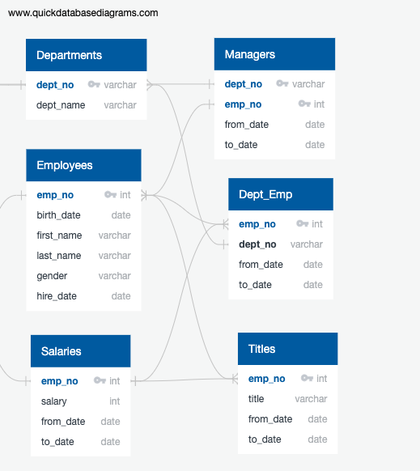

# Pewlett Hackard Analysis with SQL

## Overview of Project

The following analysis is for the company Pewlett Hackard to determine the number of employees that will be retiring by title. Additionally, the Sales and Development Managers would like to institute a new mentor program where employees that are eligible for retirement transition to part-time status to train their replacement. This analysis identifies employees that would be eligible for said mentorship program. 

## Data and Resources

Data Source: 

- departments.csv
- dept_emp.csv
- dept_manager.csv
- employees.csv
- salaries.csv
- titles.csv
- Employee_Database_challenge.sql

Data Software: 

- PostgreSQL 11.16
- pgAdmin 4 v6.8

## Model 

The below Entity Relationship Diagram (ERD) visually represents the relationships between the six .csv files in the data source and identifies primary and foreign keys.  

## Results

## Summary
